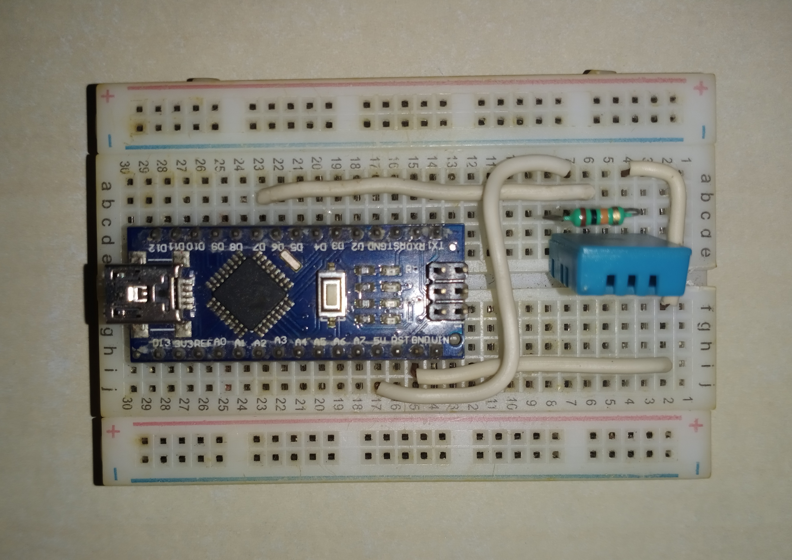

# Arduino + Python
It is a desktop GUI made using python that monitors the surrounding temperature and humidity.

## The Need 
This is a simple Project developed to display Arduino's output by interfacing with Python.

## Requirements
Any Arduino Board, Data cable to connect Arduino with PC, 10k Resistor, Breadboard, DHT11 Temperature and Humidity sensor, Connecting Wires.

## Some Pictures of the Project

  
  
UI of the Python Program

  
  
Schematic Diagram

  
  
Connection Diagram

