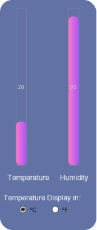
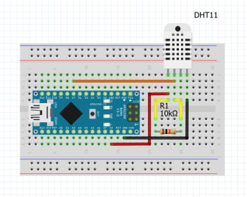

# Arduino + Python
It is a desktop GUI made using python that monitors the surrounding temperature and humidity.

## The Need 
This is a simple Project developed to display Arduino's output by interfacing with Python.

## Requirements
Any Arduino Board, Data cable to connect Arduino with PC, 10k Resistor, Breadboard, DHT11 Temperature and Humidity sensor, Bluetooth Module (I have used HC-05), Connecting Wires.

## Part-1 establishing a wired connection:

### Testing Connection
Make sure to enter the correct COM port number in line 14 when connecting the Board to the PC (Mine is COM3)

```
ser = serial.Serial("COM3", 9600)
```

The program checks whether Arduino is connected with try except
```
try:
  ser = serial.Serial("COM3", 9600)
  ...
  ...
  ...
except serial.serialutil.SerialException:
  print("Arduino not connected....")
```

## Some Pictures of the Project
<p align=center>
  
  <p align=center>UI of the Python Program</p>
</p>

<p align=center>
  
  <p align=center>Schematic Diagram</p>
</p>

<p align=center>
  
  <p align=center>Connection Diagram</p>
</p>

## Part-2 Establishing a wireless connection with Bluetooth module

### Bluetooth Upgrade
Just by adding a bluetooth module to the circuit and with the same Arduino code, we can make the circuit wireless.

Go to your bluetooth settings in windows and there will be an advance menu where you can find the outgoing COM port number, this is the number you will use in line 14 to open a serial connection to the Bluetooth module. Mine is COM 6 so it will be 

```
ser = serial.Serial("COM6", 9600)
```

<p align=center>
  
  <p align=center>Schematic Diagram with Bluetooth module</p>
</p>

<p align=center>
  
  <p align=center>Connection Diagram with Bluetooth module</p>
</p>